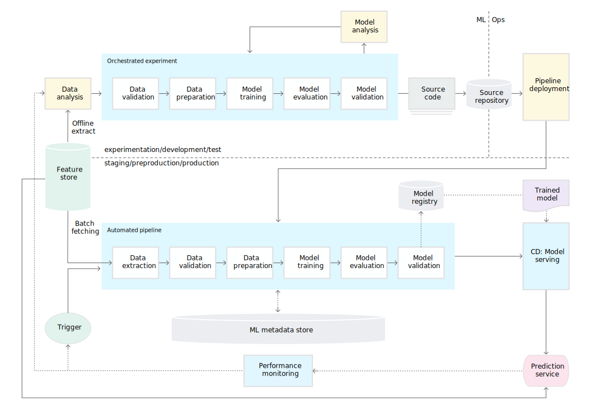

# [MLOps: 머신러닝의 지속적 배포 및 자동화 파이프라인  | Google Cloud](https://cloud.google.com/solutions/machine-learning/mlops-continuous-delivery-and-automation-pipelines-in-machine-learning?hl=ko)

## 수동 프로세스

## ML 파이프라인 자동화

## CI/CD 파이프라인 자동화

