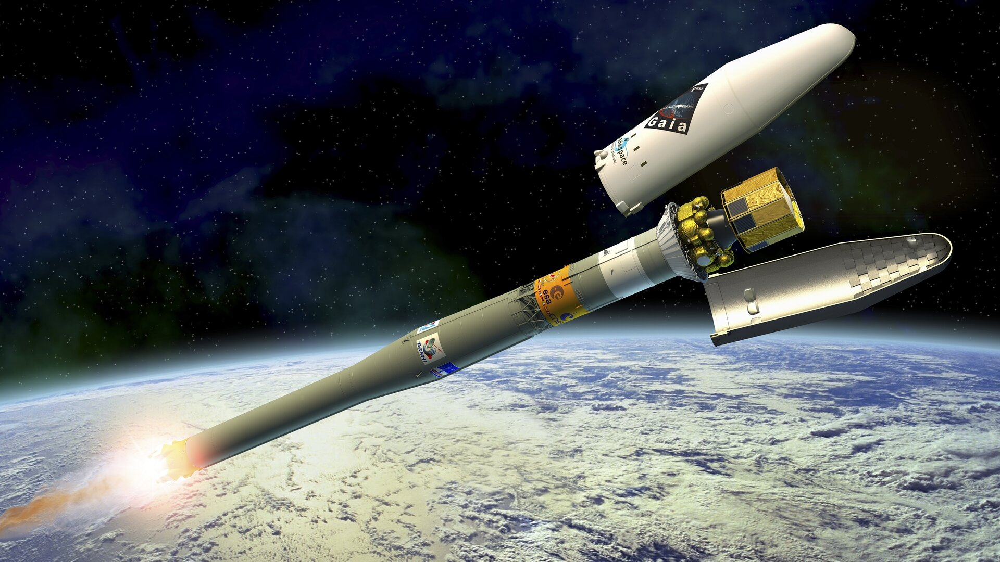

pip show kubeflow-fairing
Name: kubeflow-fairing
Version: 1.0.2

[Releases · kubeflow/fairing (github.com)](https://github.com/kubeflow/fairing/releases) : 2020-1204 현재 latest v1.0.2


공식 문서

- [Overview of Kubeflow Fairing | Kubeflow](https://www.kubeflow.org/docs/components/fairing/fairing-overview/)
- [kubeflow/fairing: Python SDK for building, training, and deploying ML models (github.com)](https://github.com/kubeflow/fairing)
- [Welcome to Kubeflow Fairing SDK API reference — Kubeflow Fairing v0.7.0 documentation (kubeflow-fairing.readthedocs.io)](https://kubeflow-fairing.readthedocs.io/en/latest/index.html)

정리된 blog

- [Kubeflow – Fairing – 지구별 여행자 (kangwoo.kr)](https://www.kangwoo.kr/2020/03/14/kubeflow-fairing/)
- [[Cloud\] Kubeflow | 머릿속에 안남으니 기록하자: (jx2lee.github.io)](https://jx2lee.github.io/cloud-kubeflow_fairing/)


# Fairing이란

Kubeflow 환경에서 ML 모델을 손쉽게 배포/실행할 수 있는 Python Package

- python 으로 작성한 파일을 도커 이미지로 build / push
- k8s API 서버 요청하여  Job, TFJob 등으로 배포 / 실행

# 장단점

### 장점

- SDK로 Image를 build 하고 Docker registry에 push
- Image를 간편하게 K8s에 Job, TFJob 등으로 배포 / 실행
- Jupyter Notebook을 그래도 Job으로 배포 / 실행 가능

### 단점

- Image에 추가 패키지/모듈 설치가 어려워 잘 준비된 Base Image가 필요

# Fairing 실행 단계

### Preprocess

Image를 빌드하고 Job으로 "실행시킬 대상"을 명시.

Dockerfile의 COPY, CMD 등에 해당.

- function 

  ``` python
  def train():
      ...
      ...
      
  my_fairing_run = fairing.config.fn(train)
  my_fairing_run()
  ```

- python

  ```python
  fairing.config.set_preprocessor(
      'python', 
       command = ['python3'],  # default: python
       input_files = ['00-python-file-to-fairing.py'],     
  )
  ```

- notebook : Notebook을 python 파일로 변환하여 진행  (대상이 되는 Notebook 코드에서 python 코드가 아닌 부분을 제거)

  ```python
  fairing.config.set_preprocessor(
      'notebook', 
      notebook_file = '03-A-notebook-to-fairing.ipynb'
  )
  ```

- full_notebook : Job에서 python 코드가 아닌 부분들을 포함해서 전체 Notebook을 그대로 실행. (Notebook 실행에 papermill을 사용)

### Build

Dockerizing 방법을 명시.

Dockerfile의 FROM, docker build의 --tag 등에 해당.

- **append** : 기존 컨테이너 이미지를 바탕으로, 코드를 새 레이어로 추가하고 push. Docker daemon을 사용하지 않음.

  ```python
  fairing.config.set_builder(
      'append',
      base_image = 'tensorflow/tensorflow:latest-py3',
      registry   = 'kubeflow-registry.default.svc.cluster.local:30000',
      image_name = 'my-fairing-job', 
      push=True
  )
  ```

- **docker** : Docker daemon을 사용하여, 이미지를 빌드

- **cluster** : 구글 컨테이너 툴인 Kaniko 를 이용해 이미지를 빌드

### Deploy

이미지를 K8s에 배포하여 Job으로 실행

kubectl run 또는 kubectl apply에 해당

- Job : 쿠버네티스 Job 리소스를 사용

  ```python
  fairing.config.set_deployer(
      'job',
      namespace='myspace',
      pod_spec_mutators=[
          k8s_utils.get_resource_mutator(cpu=1, memory=5)
      ]
  )
  ```

- TfJob : Kubeflow의 TFJob 컴포넌트를 사용 (예제: [fairing/main.py at master · kubeflow/fairing (github.com)](https://github.com/kubeflow/fairing/blob/master/examples/distributed-training/main.py))

- PyTorchJob : Kubeflow의 PyTorchJob 컴포넌트를 사용

- **GCPJob** : GCP에게 학습 작업 보냅니다.

- **Serving** : 쿠버네티스의 디플로이먼트(deployment)와 서비스(service)를 사용하여, 예측(prediction) 엔드포인트를 서빙합니다.

- **KFServing** : KFServing을 사용하여, 예측(prediction) 엔드포인트를 서빙합니다.




[Payload fairing - Wikipedia](https://en.wikipedia.org/wiki/Payload_fairing)